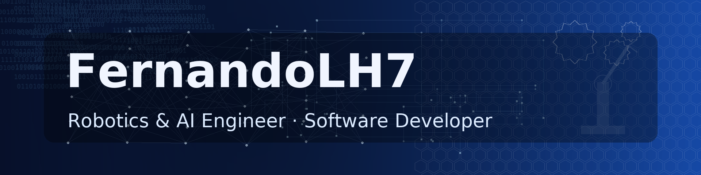

# Welcome! I'm FernandoLH7 👋

  

  <!-- Python -->
  

  <!-- C# -->
  

  <!-- C -->
  

  <!-- FastAPI -->
  

  <!-- Node.js -->
  

  <!-- Firebase -->
  

  <!-- MySQL -->
  

  <!-- Add more badges below -->
  <!--  -->

## 🤖 Robotics & AI Engineer · Junior Software Developer
I build **end-to-end autonomous systems**: perception (YOLOv8/CNNs), motion planning & control, and robust software on **ROS/ROS2**. From simulation (**Gazebo**) to real robots, I turn research into reliable, working products—with clean code, CI, and measurable results.

---

### ⚡ Quick snapshot
- 🧠 **Computer Vision & AI:** YOLOv8, CNNs, classical CV (OpenCV), DL/ML best practices  
- 🐝 **Optimization:** Particle Swarm Optimization (**PSO**) in C for continuous functions (Sphere benchmark)  
- 🤖 **Robotics stack:** ROS & **ROS2**, SLAM/Visual Odometry, path planning & controllers, Gazebo  
- 🛠️ **Software:** C++ · Python · Linux · Docker · GitHub Actions (CI)  
- ☁️ **Cloud (GCP):** Cloud Run / Functions, **BigQuery**, Pub/Sub, Cloud Build — aligned with the **Google Professional Cloud Developer** learning path  
- 🤝 **Open to:** research, R&D, innovation, internships, and collaborations on personal/industry projects

---

### 🧩 What I work with (toolbox)
**Robotics:** ROS2 · ROS · Gazebo · nav/controls · SLAM/VO  
**Perception/AI:** YOLOv8 · CNNs · OpenCV · training & evaluation pipelines  
**Optimization:** PSO (global-best, Sphere), numerical experimentation  
**Software:** C++ · Python · modern CMake · unit tests · CI on GitHub Actions  
**Cloud/Data:** BigQuery · Cloud Run/Functions · Pub/Sub · Cloud Build · Docker  
**Dev XP:** clean APIs · reproducible experiments · docs that others can build on

---

### 🚀 Currently building
- 🕳️ **Pothole detection & avoidance**: vision + control loop in ROS2 (from sim to deployment)  
- 🧪 **PSO benchmarking**: tuning & analyzing convergence on standard functions (Sphere and beyond)  
- 🛤️ **Lane detection** experiments for driving scenarios in sim (Gazebo/ROS)

---

### ✅ Highlights you can expect in my repos
- Clear **READMEs** with quick start and diagrams  
- Minimal, readable **C++/Python** code, comments where they matter  
- **CI** runs for builds/tests and (optionally) auto-generated plots  
- Reproducible **experiments** and structured results

---

### 🌟 Featured projects
> Replace the links below with your public repos as you publish them.

- **PSO in C — Sphere Minimization** → `pso-c-sphere` *(baseline optimizer + docs & visuals)*  
- **Pothole Avoidance (ROS2)** → `pothole-avoidance-ros2` *(perception → decision → control)*  
- **Lane Detection (Perception)** → `lane-detection-ros2` *(inference pipeline & sim hooks)*  
- **Autonomous Waste Robot (Prototype)** → `autonomous-waste-robot` *(navigation + CV)*

---

### 🧭 How I work
- Start simple → **prove value fast** with a demo  
- Measure what matters → iterate with **data**  
- Keep it clear → code + docs that **teammates love** to read  
- Treat reliability as a feature → **CI**, checks, and guardrails

---

### 📬 Let’s connect
I’m open to internships, research collabs, and roles in **autonomous systems / applied AI**.  
- LinkedIn: www.linkedin.com/in/fernando-andrés-lópez-hernández-4a7480271
- Email: fernando.lopezhz@udlap.mx

If you like my work, feel free to ⭐️ a repo and say hi!
